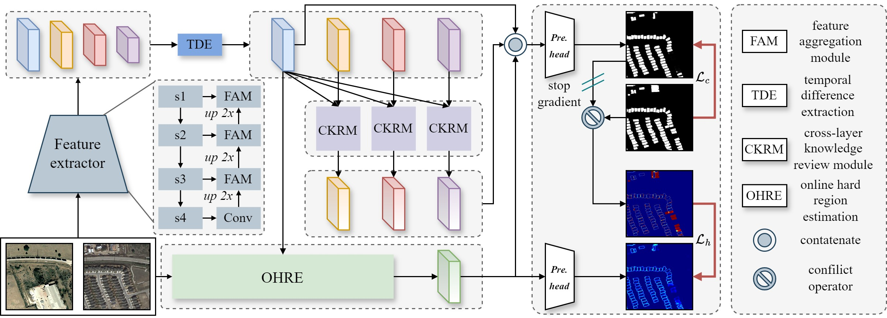

# <p align=center>`Boosting Remote Sensing Change Detection via Hard Region Mining (Under Review)`</p>

This repository contains simple python implementation of our paper HRMNet.

### 1. Overview

<p align="center">
     <br />
</p>

A framework of the proposed AR-CDNet. Initially, the bi-temporal images pass through a shared feature extractor to obtain bi-temporal features, and then multi-level temporal difference features are obtained through the TDE. CKRMs fully explore the multi-level temporal difference knowledge to enhance the feature capabilities. The OHRE branch estimates pixel-wise hard samples corresponding of changed and unchanged regions, supervised by the diversity between predicted change maps and corresponding ground truth in the training process. Finally, the multi-level temporal difference features and hard region aware feature obtained from the OHRE branch are aggregated to generate the final change maps. <br>

### 2. Usage
+ Prepare the data:
    - Download datasets [LEVIR](https://github.com/S2Looking/Dataset), [BCDD](https://study.rsgis.whu.edu.cn/pages/download/building_dataset.html), and [MCD](https://rodare.hzdr.de/record/3251).
    - Crop LEVIR, BCDD, and MCD datasets into 512x512 patches. 
    - The pre-processed BCDD dataset can be obtained from [BCDD_512x512](https://drive.google.com/file/d/1VrdQ-rxoGVM_8ecA-ObO0u-O8rSTpSHA/view?usp=sharing).
    - For MCD dataset, we provide `./datasets/split_MCD.py` to Crop MCD into 512x512 patches. 
    - Prepare datasets into the following structure and set their path in `train.py` and `test.py`
    ```
    ├─Train
        ├─A        ...jpg/png
        ├─B        ...jpg/png
        ├─label    ...jpg/png
        └─list     ...txt
    ├─Val
        ├─A
        ├─B
        ├─label
        └─list
    ├─Test
        ├─A
        ├─B
        ├─label
        └─list
    ```
    - Generate list file as `ls -R ./label/* > test.txt` or using `./datasets/data_inf.py`

+ Prerequisites for Python:
    - Creating a virtual environment in the terminal: `conda create -n HRMNet python=3.8`
    - Installing necessary packages: `pip install -r requirements.txt `

+ Train/Test
    - `sh train.sh`
    - `sh test.sh`

